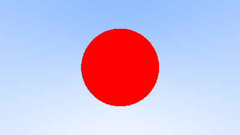

## krt

The Korn shell RayTracer

## Contents

1. [Synopsis](#synopsis)
2. [Install](#install)
3. [Tests](#tests)
4. [Contributing](#contributing)
5. [License](#license)

## Synopsis

    krt [-s sqrt] [-n nearest]

krt is the beginning of a raytracer written in pure shell.
There is actually nothing particularly _korny_ about it, this is just a reference to my other project [kbf][kbf].
It is currently compatible with ksh and bash, and probably with any shell implementing the `local` keyword.

The option `-s` allows to select among three algorithms to calculate the square root of a given number: `heron`, `newton` and `bakhshali`.
All three are implemented in `sqrt.sh`.
The default algorithm is `newton` and was picked at random.

The option `-n` allows to select two methods of finding the nearest approximation of square root: `dynamic` and `fixed`.
The first method, `dynamic`, is extremely slow and should not be used.
The second, `fixed`, is the default but required a pre-generated list of squares named `perfect_squares.txt`.

Such a list can be generated beforehand using this helper script:

```
$ perfect_squares.sh > perfect_squares.txt
```

For now there are no scene, no floor, no lights, just a hanging red sphere on a blue background.
This is the same as section 5 of [Ray Tracing in One Weekend][raytracinginoneweekend].

Here it is:



It took my laptop 47 minutes to generate it.

## Install

### Requires

* Any a-bit-more-than-POSIX shell.

### Build

There is a makefile available, just run `make`.
Note that there are no `install` rule.

## Contributing

Either send [send GitHub pull requests](https://github.com/Aversiste/krt) or [send patches on SourceHut](https://lists.sr.ht/~tleguern/misc).

## License

All the code is licensed under the ISC License.

[kbf]: https://git.sr.ht/~tleguern/kbf
[raytracinginoneweekend]: https://raytracing.github.io/books/RayTracingInOneWeekend.html
